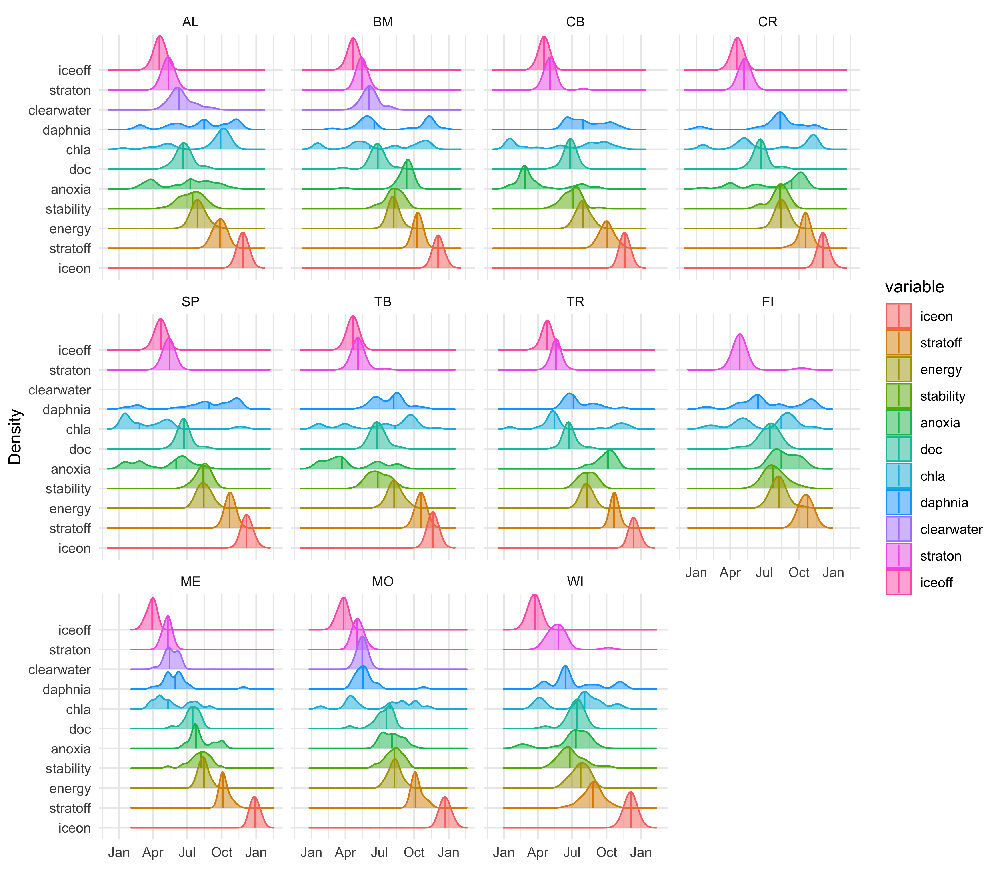

# NTL-LTER Phenology
Scripts and outputs to process the long-term NTL-LTER data by Cal Buelo, Kait Reinl, Robert Ladwig, Hilary Dugan & Paul Hanson.

Long-term lake data were obtained from the North Temperate Lakes Long-Term Ecological Research program (#DEB-1440297 and #DEB-2025982).

<!-- -->
